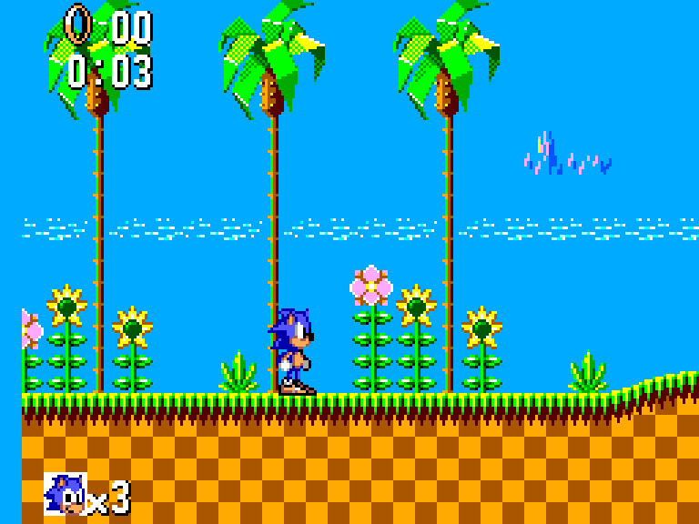
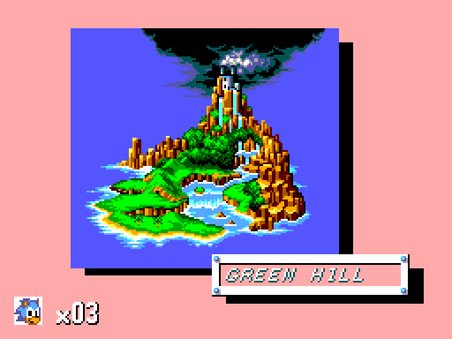

# SonicTheHedgehogSMSRecomp

Static recompilation of *Sonic the Hedgehog* (Sega Master System, 1991) into
native C, using the [smsggrecomp](https://github.com/mstan/smsggrecomp)
framework. This repo is the per-game side: the `game.toml`, the build glue, and
a pre-built release. The ROM and the generated C are **not** here — you supply
your own legally-dumped ROM and regenerate locally.

## What "static recompilation" means here

The game's Z80 machine code is translated **ahead of time** into C and compiled
to a native binary — it is not interpreted at runtime. The rest of the Master
System (VDP, SN76489 sound, controller/system ports, the Sega mapper) is modeled
by the [smsggrecomp](https://github.com/mstan/smsggrecomp) runtime. Computed
jumps the static analysis can't resolve fall back to a bundled Z80 interpreter
over the live bus. You supply your own legally-dumped copy of the ROM; it is
**never** redistributed here.

## Status

> **v0.0.2 — early pre-release. Expect bugs.**
> Across the title and attract-demo sequence we exercised (~60s), the build runs
> entirely as recompiled native code (no interpreter-fallback dispatch miss was
> hit on that path) and renders byte-exact to the superzazu interpreter oracle on
> palette (CRAM) and system RAM. The game has **not** been played end to end:
> coverage across full gameplay is unverified, and more code paths will surface
> during real play (the built-in interpreter fallback handles them when they do).

## Screenshots

Recompiled native build (no emulator), captured running the .sms ROM:

| Green Hill Zone | Zone title card |
|---|---|
|  |  |

## Quick start (pre-built release)

1. Download `SonicTheHedgehogSMSRecomp-windows-x64.zip` from
   [Releases](../../releases) and unzip it (keep `SDL2.dll` next to the `.exe`).
2. Supply your own legally-obtained *Sonic the Hedgehog (SMS)* ROM (`.sms`).
3. Run it with your ROM:
   ```
   SonicTheHedgehogSMSRecomp.exe path\to\sonicthehedgehog.sms --window 3
   ```

## Controls

| Key | Action |
|-----|--------|
| Arrow keys | D-pad |
| Z | Button 1 (jump) |
| X | Button 2 |
| Enter | Start / Pause |
| Esc | Quit |

## ROM

| Field | Value |
|-------|-------|
| Title | Sonic the Hedgehog (SMS) |
| Region | SMS Export |
| CRC32 | `0xB519E833` |
| Size | 256 KB |

The ROM is **never** redistributed — supply your own legally-dumped copy.

## Building from source

Requires the [smsggrecomp](https://github.com/mstan/smsggrecomp) engine checked
out as a sibling directory (`../smsggrecomp`) at the commit in `smsggrecomp.pin`,
its recompiler built (`recompiler/build/SmsRecomp.exe`), plus MinGW `gcc` and
SDL2 (MSYS2 `mingw64`).

```powershell
# from this repo, with your ROM present and ../smsggrecomp built:
powershell -File build.ps1            # regenerates the C from your ROM, then builds the windowed exe
```

The recompiler reads `game.toml`, writes `generated/<prefix>_{full,dispatch,layout}.c`
(gitignored — a derivative of the ROM), and `build.ps1` compiles those plus the
shared runner into `SonicTheHedgehogSMSRecomp.exe`.

## Repo layout

| Path | Purpose |
|------|---------|
| `game.toml` | Per-game config: ROM identity, mapper, RAM layout, discovery seeds, jump tables. |
| `build.ps1` | Regenerate from your ROM + build the windowed exe. |
| `smsggrecomp.pin` | The engine commit this game was verified against. |
| `generated/` | Recompiler output (gitignored; regenerated from your ROM). |

## License

Not yet declared. Code in this repo is original. The *Sonic the Hedgehog* ROM
and any data derived from it are **not** in this repo and are not licensed for
redistribution.
